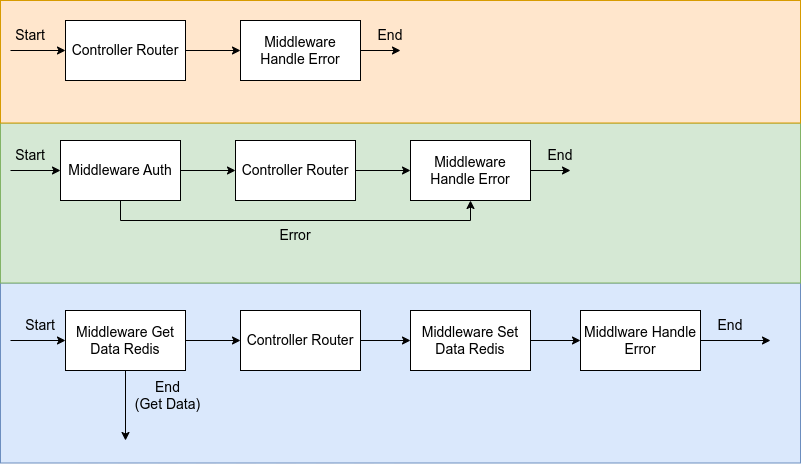
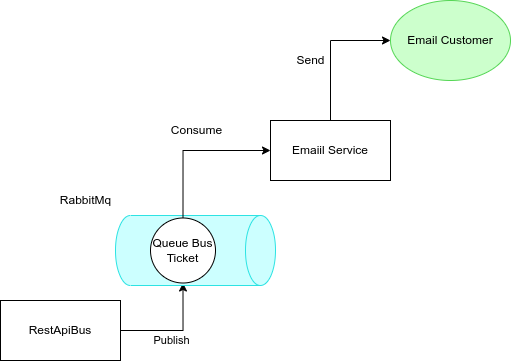
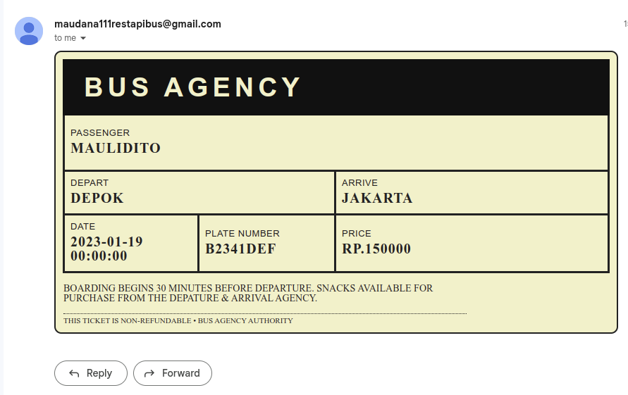

# Rest Api Bus Travel

- [version 1.0](https://github.com/Maulidito/restapi-bus/tree/e4a605c0f629203e73a3b60418968b3bf616bff8) (CRUD Data Entity)

- [version 1.1](https://github.com/Maulidito/restapi-bus/tree/dd752fa446c5d6df6d9a797cd3eeacffc7647acc) (adding all filter on http method GET)

- [version 1.2](https://github.com/Maulidito/restapi-bus/tree/aab5e04d8f2148dfd83e14cfa56b73ddf88f2dd3) (adding schedule entity and change attribute of ticket)

- [version 1.3](https://github.com/Maulidito/restapi-bus/tree/563cc904ae091aafb2ee33744e2d10ed1082fa1e) (adding authentication for agency entity)

- [version 1.4](https://github.com/Maulidito/restapi-bus/tree/20b78ef591e6c747bbd57627d85795fb0b9251d0) (adding redis database for optimization)

- [version 1.5](https://github.com/Maulidito/restapi-bus/tree/e00c8893ce99810a2ca5113367389a168c5c204e) (adding email service with rabbit mq for communicating)

## Description

My Portofolio Rest api with golang dan mysql for the database

## Framework

the framework i use in this project is [Gin](https://github.com/gin-gonic/gin)

## Entity

- Customer
- Agency
- Bus
- Ticket
- Driver
- Schedule

i also use Erd in this [link](https://drawsql.app/teams/maulidito-dwinandana/diagrams/rest-api-bus) using [drawsql](https://drawsql.app/)

<details><summary>  Entity Details</summary>
<p>


- ### Customer

| Entity Name  | Type Data | Key         |
| ------------ | --------- | ----------- |
| customer_id  | int       | **Primary** |
| name         | string    | -           |
| phone_number | string    | -           |
| email        | string    | -           |

- ### Driver

| Entity Name | Type Data | Key         |
| ----------- | --------- | ----------- |
| driver_id   | int       | **Primary** |
| agency_id   | int       | Foreign     |
| name        | string    | -           |

- ### Bus

| Entity Name  | Type Data | Key         |
| ------------ | --------- | ----------- |
| bus_id       | int       | **Primary** |
| agency_id    | int       | Foreign     |
| number_plate | string    | -           |

- ### Agency

| Entity Name | Type Data | Key         |
| ----------- | --------- | ----------- |
| agency_id   | int       | **Primary** |
| name        | string    | -           |
| place       | string    | -           |
| username    | string    | -           |
| password    | string    | -           |

- ### Ticket

| Entity Name | Type Data | Key         |
| ----------- | --------- | ----------- |
| ticket_id   | int       | **Primary** |
| schedule_id | int       | Foreign     |
| customer_id | int       | Foreign     |
| date        | timestamp | -           |

- ### Schedule

| Entity Name    | Type Data | Key         |
| -------------- | --------- | ----------- |
| schedule_id    | int       | **Primary** |
| from_agency_id | int       | Foreign     |
| to_agency_id   | int       | Foreign     |
| driver_id      | int       | Foreign     |
| bus_id         | int       | Foreign     |
| price          | int       | -           |
| date           | timestamp | -           |

</p>
</details>

## Diagram Project


From the image We Know

- One Controller only have one Service
- One Service can have many repository
- One Repository only communicate with one database

## Middleware Pipeline



1. The First is the base middleware of the router, every error in controller will catch in middleware error using panic function and recover to catch

2. The Second is the Authentication Middleware, so when the endpoint need an account, the request need to pass the auth middleware

3. The Third is the Redis Middleware, the redis middleware just implented in specific router for example in get one agency, get one bus, get one schedule, etc. The redis middleware will always get the data first from the redis, if the data didn't exist then move to the controller but if exist then send to user.

## Workflow Project


This image show workflow from client send request and get response in REST API

## Email Service



no longer using sendgrid

The goal of Email service is send a ticket bus to email user. If we see the image i use message queue for connecting to email service and rest api, and ~~i user SendGrid Api~~ smtp gmail to handle delivery email. The technology message queue is using [RabbitMq](https://rabbitmq.com/)

The flow email service work:

1. Rest api declare queue and bind the exchange, then publish detail ticket to MQ
2. Email Service declare queue if didnt exist, then consume queue
3. Email Service Render the data of detail ticket to html
4. Email Service send to email user with smtp gmail

example of email



## Documentation Rest Api

Using [OpenApi](https://app.swaggerhub.com/apis/Maulidito/api-bus_travel) For Documentation

## How To Run with Docker Images

- You can just download or copy the [docker-compose.yaml](https://github.com/Maulidito/restapi-bus/blob/main/docker-compose.yaml)

- make .env file, example in this [file](https://github.com/Maulidito/restapi-bus/blob/main/.env.example). the .env file must same directory with docker-compose

- make sure port restapibus in [env](https://github.com/Maulidito/restapi-bus/blob/main/.env.example) same with [docker-compose](https://github.com/Maulidito/restapi-bus/blob/main/docker-compose.yaml)

example

.env

```
PORT=:8888
```

docker-compose

```yaml
restapi:
  container_name: restapibus
  image: maulidito/restapibus:v1.5
  ports:
    - 8080:8888
  env_file:
    - .env
```

\*note : 8080 means port in host or your computer and 8888 means port in container on docker

- Command "docker-compose up" on CLI
- Check if docker container have been build, command "docker container ls -a"
- If the container exist and the container not have been start, command "docker container start restapibus" and "docker container start db_mysql_bus"
- The Service starting
