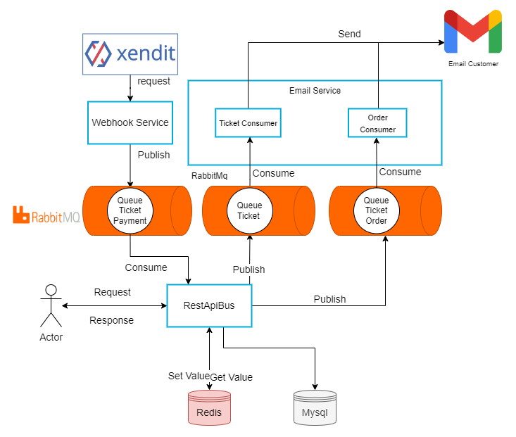

<h1 align="center"> Rest Api Bus </h1> 

## Table of Contents

- [Introduction](#introduction)
- [Version History](#version-history)
- [Entity](#entity)
- [Features](#features)
- [Project Architecture](#project-architecture)
- [Diagram Layer](#diagram-layer)
- [Middleware Pipeline](#middleware-pipeline)
- [Message Queue System](#message-queue-system)
- [Documentation Rest Api](#documentation-rest-api)
- [Getting Started](#getting-started)
    - [Prerequisites](#prerequisites)
    - [A think u need todo](#a-think-u-need-todo)


<!-- END doctoc generated TOC please keep comment here to allow auto update -->

## Introduction

Welcome to my personal portolio, i'm Maulidito Dwinandana, a passionate software engineer with an interest around backend.  this portfolio is to showcase my project and my experience. through this project i learn a lot of how api work.

This Project Rest api is about managing bus, agency, departure schedule, and order ticket bus, however this rest api are just used by admin of each agency. this also still didn't have a web view, it just only api. despite it's only api, i have implemented some current technology that used by the industry, for example rabbitmq, docker, redis. Also i implemented a little of microservice, like webhook service and email service.


### Version History

- [version 1.0](https://github.com/Maulidito/restapi-bus/tree/e4a605c0f629203e73a3b60418968b3bf616bff8) (CRUD Data Entity)

- [version 1.1](https://github.com/Maulidito/restapi-bus/tree/dd752fa446c5d6df6d9a797cd3eeacffc7647acc) (adding all filter on http method GET)

- [version 1.2](https://github.com/Maulidito/restapi-bus/tree/aab5e04d8f2148dfd83e14cfa56b73ddf88f2dd3) (adding schedule entity and change attribute of ticket)

- [version 1.3](https://github.com/Maulidito/restapi-bus/tree/563cc904ae091aafb2ee33744e2d10ed1082fa1e) (adding authentication for agency entity)

- [version 1.4](https://github.com/Maulidito/restapi-bus/tree/20b78ef591e6c747bbd57627d85795fb0b9251d0) (adding redis database for optimization)

- [version 1.5](https://github.com/Maulidito/restapi-bus/tree/e00c8893ce99810a2ca5113367389a168c5c204e) (adding email service with rabbit mq for communicating)


## Entity

- Customer
- Agency
- Bus
- Ticket
- Driver
- Schedule

you can also see Erd in this [link](https://drawsql.app/teams/maulidito-dwinandana/diagrams/rest-api-bus) using [drawsql](https://drawsql.app/)

## Features

- CRUD of All Entity
- Authentication using Json Web Token
- Payment with Virtual Account by Xendit
- Send Email To Customer through SMTP
- Auto Schedule with Cron Job
- Booking Seat From Ticket


## Project Architecture



So in this project have 3 server, that are Webhook Server, Email Server, RestApiBus Server.

- Webhook Server (for get all request from xendit to queue)
- Email Server (get all data from queue forwarded to email customer)
- RestApiBus Server (Managing all request, respond, and logic that related on bus management)

## Diagram Layer


From the image We Know

- One Controller only have one Service
- One Service can have many repository
- One Repository only communicate with one database

so in the layer i implemented a repository pattern, that means i separate the logic layer with data access layer

## Middleware Pipeline


1. The First is the base middleware of the router, every error in controller will catch in middleware error using panic function and recover to catch

2. The Second is the Authentication Middleware, so when the endpoint need an account, the request need to pass the auth middleware

3. The Third is the Redis Middleware, the redis middleware just implented in specific router for example in get one agency, get one bus, get one schedule, etc. The redis middleware will always get the data first from the redis, if the data didn't exist then move to the controller but if exist then send to user.


## Message Queue System 


The goal of message queue is to send a data to consumer. If we see the image i use message queue for connecting to email server and publisher, and smtp gmail to handle delivery email. The technology message queue is using [RabbitMq](https://rabbitmq.com/)

The flow email service work:

1. Declare the queue and the exchange
2. Email Service bind queue , then consume queue
3. Rest api bind the exchange, then publish data to MQ
4. Email Service Render the data of detail ticket to html
5. Email Service send to email user with smtp gmail

- example of ticket email


- example of email ticket order


## Documentation Rest Api

Using [OpenApi](https://app.swaggerhub.com/apis/Maulidito/api-bus_travel) For Documentation

## Getting Started 

### Prerequisites

#### A think u need todo
 - Get App password from Gmail [instruction](https://support.google.com/mail/answer/185833?hl=en) 

- Register and Get Api Secret Key in [xendit](https://www.xendit.co/en-id/)

- Register and Get Api token [nginx](https://ngrok.com/)


you need have docker and git with lastest 

version 
#### docker
- [windows version](https://docs.docker.com/desktop/install/windows-install/)
- [ubuntu version](https://docs.docker.com/engine/install/ubuntu/)
- [mac os](https://docs.docker.com/desktop/install/mac-install/)

to make sure your docker has been installed in your computer 
```sh
docker -v
```

#### git
- [windows version](https://git-scm.com/downloads)

linux and mac user use the command 
```sh
sudo apt install git
```

### Installation


1. clone the repository
``` sh
git clone https://github.com/Maulidito/restapi-bus
```
if you dont want to clone all repository just copy .env and docker-compose.yaml file to your computer
2. make the env file and copy paste from .env.example
``` sh
cat .env.example >> .env
```

3. configure the env file
you can change the rest api port and change the username and password db or rabbitmq but dont change the port to db, rabbitmq, and smtp

Things that cannot be changed
``` js
HOST_DB = mysql
PORT_DB = 3306 
HOST_RDB = redis 
PORT_RDB = 6379
SMTP_MAIL_SERVER = smtp.gmail.com
SMTP_MAIL_PORT = 465
HOST_RMQ = rabbitmq
PORT_RMQ = 5672
```
inserted app password gmail and xendit that you created to env file 
``` js
APP_PASSWORD_GMAIL = example_app_password
PASSWORD_XENDIT = example_password_xendit
SECRET_KEY_XENDIT = example_secret_key
WEBHOOK_VERIFICATION_TOKEN = example_webhook_token
NGROK_AUTHTOKEN = example_ngrok_token
```

4. do 
``` sh
docker compose up -d
```

5. make sure your container is running and healthy
``` sh 
docker ps
```
you can monitor it with watch
``` sh 
watch docker ps
```

6. Done, to make sure this program is running do
``` sh 
curl -X GET http://localhost:8080/v1/agency
```

