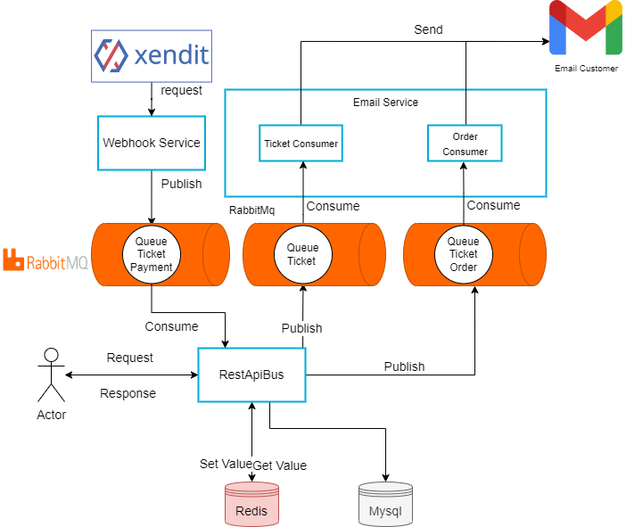
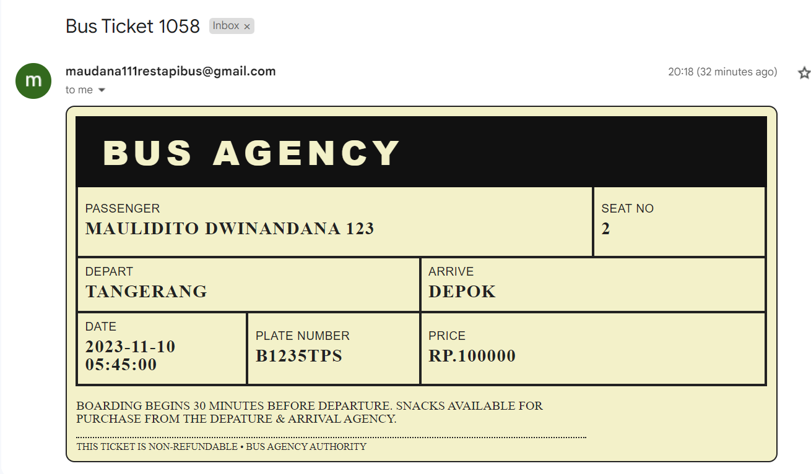

# Rest Api Bus Travel

Rest api about managing bus and order ticket bus, this rest api are just used by admin of each agency

### Version History

- [version 1.0](https://github.com/Maulidito/restapi-bus/tree/e4a605c0f629203e73a3b60418968b3bf616bff8) (CRUD Data Entity)

- [version 1.1](https://github.com/Maulidito/restapi-bus/tree/dd752fa446c5d6df6d9a797cd3eeacffc7647acc) (adding all filter on http method GET)

- [version 1.2](https://github.com/Maulidito/restapi-bus/tree/aab5e04d8f2148dfd83e14cfa56b73ddf88f2dd3) (adding schedule entity and change attribute of ticket)

- [version 1.3](https://github.com/Maulidito/restapi-bus/tree/563cc904ae091aafb2ee33744e2d10ed1082fa1e) (adding authentication for agency entity)

- [version 1.4](https://github.com/Maulidito/restapi-bus/tree/20b78ef591e6c747bbd57627d85795fb0b9251d0) (adding redis database for optimization)

- [version 1.5](https://github.com/Maulidito/restapi-bus/tree/e00c8893ce99810a2ca5113367389a168c5c204e) (adding email service with rabbit mq for communicating)


## Framework

The Framework i use in this project is [Gin](https://github.com/gin-gonic/gin)

## Entity

- Customer
- Agency
- Bus
- Ticket
- Driver
- Schedule

you can also see Erd in this [link](https://drawsql.app/teams/maulidito-dwinandana/diagrams/rest-api-bus) using [drawsql](https://drawsql.app/)


## Project Architecture



## Diagram Project


From the image We Know

- One Controller only have one Service
- One Service can have many repository
- One Repository only communicate with one database

## Middleware Pipeline


1. The First is the base middleware of the router, every error in controller will catch in middleware error using panic function and recover to catch

2. The Second is the Authentication Middleware, so when the endpoint need an account, the request need to pass the auth middleware

3. The Third is the Redis Middleware, the redis middleware just implented in specific router for example in get one agency, get one bus, get one schedule, etc. The redis middleware will always get the data first from the redis, if the data didn't exist then move to the controller but if exist then send to user.

## Workflow Project


This image show workflow from client send request and get response in REST API

## Email Service


The goal of Email service is send a ticket bus to email user. If we see the image i use message queue for connecting to email service and rest api, and smtp gmail to handle delivery email. The technology message queue is using [RabbitMq](https://rabbitmq.com/)

The flow email service work:

1. Rest api declare queue and bind the exchange, then publish detail ticket to MQ
2. Email Service declare queue if didnt exist, then consume queue
3. Email Service Render the data of detail ticket to html
4. Email Service send to email user with smtp gmail

- example of ticket email



- example of email ticket payment


## Documentation Rest Api

Using [OpenApi](https://app.swaggerhub.com/apis/Maulidito/api-bus_travel) For Documentation

## Getting Started 

### Prerequisites

#### A think u need todo
 - Get App password from Gmail [instruction](https://support.google.com/mail/answer/185833?hl=en) 

- Register and Get Api Secret Key in [xendit](https://www.xendit.co/en-id/)

- Register and Get Api token [nginx](https://ngrok.com/)


you need have docker and git with lastest 

version 
#### docker
- [windows version](https://docs.docker.com/desktop/install/windows-install/)
- [ubuntu version](https://docs.docker.com/engine/install/ubuntu/)
- [mac os](https://docs.docker.com/desktop/install/mac-install/)

to make sure your docker has been installed in your computer 
```sh
docker -v
```

#### git
- [windows version](https://git-scm.com/downloads)

linux and mac user use the command 
```sh
sudo apt install git
```

### Installation


1. clone the repository
``` sh
git clone https://github.com/Maulidito/restapi-bus
```
if you dont want to clone all repository just copy .env and docker-compose.yaml file to your computer
2. make the env file and copy paste from .env.example
``` sh
cat .env.example >> .env
```

3. configure the env file
you can change the rest api port and change the username and password db or rabbitmq but dont change the port to db, rabbitmq, and smtp

Things that cannot be changed
``` js
HOST_DB = mysql
PORT_DB = 3306 
HOST_RDB = redis 
PORT_RDB = 6379
SMTP_MAIL_SERVER = smtp.gmail.com
SMTP_MAIL_PORT = 465
HOST_RMQ = rabbitmq
PORT_RMQ = 5672
```
inserted app password gmail and xendit that you created to env file 
``` js
APP_PASSWORD_GMAIL = example_app_password
PASSWORD_XENDIT = example_password_xendit
SECRET_KEY_XENDIT = example_secret_key
WEBHOOK_VERIFICATION_TOKEN = example_webhook_token
NGROK_AUTHTOKEN = example_ngrok_token
```

4. do 
``` sh
docker compose up -d
```

5. make sure your container is running and healthy
``` sh 
docker ps
```
you can monitor it with watch
``` sh 
watch docker ps
```

6. Done, to make sure this program is running do
``` sh 
curl -X GET http://localhost:8080/v1/agency
```

